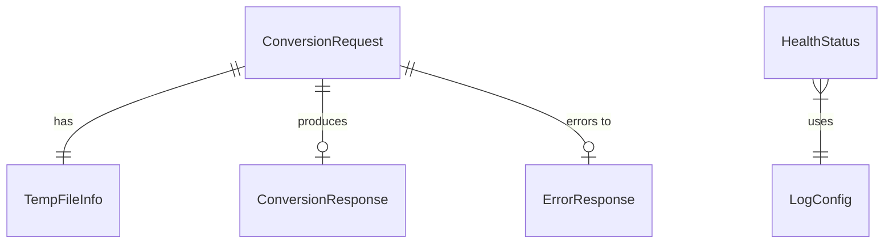
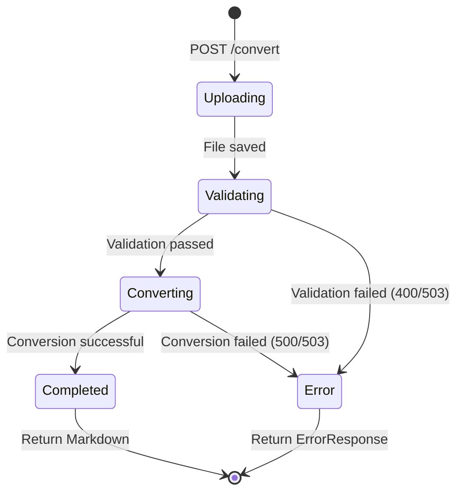

# Data Model: Server REST API

**Feature**: 003-server-api
**Date**: 2026-01-07
**Status**: Complete

## Overview

This document defines the core data entities for the PDF2md-CLI server REST API, extracted from the functional requirements in `spec.md`. All entities are designed for FastAPI with Pydantic v2 validation.

---

## Core Entities

### 1. ConversionRequest

**Purpose**: Represents incoming conversion request metadata

**Fields**:
```python
from pydantic import BaseModel
from typing import Optional

class ConversionRequest(BaseModel):
    """Incoming conversion request metadata."""
    request_id: str  # UUID for tracing (FR-API-016, FR-API-035)
    client_ip: Optional[str] = None  # Client IP address
    filename: str  # Original filename (sanitized)
    file_size: int  # File size in bytes
    content_type: str = "application/pdf"
    upload_time: float  # Unix timestamp
```

**Validation Rules**:
- `request_id`: Must be valid UUID v4
- `filename`: Must be sanitized (no path traversal, no dangerous characters)
- `file_size`: Must be ≤ 500MB (FR-API-006)
- `content_type`: Must be "application/pdf"

**Relationships**:
- One-to-one with `TempFileInfo` during upload
- One-to-one with `ConversionResponse` (result)

---

### 2. ConversionResponse

**Purpose**: Represents successful conversion response

**Fields**:
```python
class ConversionResponse(BaseModel):
    """Successful conversion response."""
    request_id: str  # UUID for tracing
    success: bool = True
    pages_processed: int  # Number of pages converted (FR-API-014)
    conversion_time: float  # Conversion duration in seconds (FR-API-015)
    output_size: int  # Output file size in bytes
    output_path: Optional[str] = None  # Path to converted Markdown file
```

**Validation Rules**:
- `pages_processed`: Must be ≥ 0
- `conversion_time`: Must be ≥ 0, typically 0-300 seconds
- `output_size`: Must be ≥ 0

**Relationships**:
- One-to-one with `ConversionRequest`

---

### 3. ErrorResponse

**Purpose**: Represents structured error response (FR-API-022)

**Fields**:
```python
class ErrorResponse(BaseModel):
    """Structured error response."""
    error_code: str  # Error type identifier
    error_detail: str  # Human-readable error message
    troubleshooting_hints: list[str] = []  # Actionable hints (FR-API-022)
    request_id: str  # UUID for tracing (FR-API-036)
    timestamp: float  # Unix timestamp
```

**Validation Rules**:
- `error_code`: Must be one of: "InvalidRequest", "InvalidPDF", "FileTooLarge", "EncryptedPDF", "ConversionError", "GPUOutOfMemory", "InsufficientDiskSpace", "ServiceUnavailable"
- `troubleshooting_hints`: Must be non-empty list of actionable hints
- `request_id`: Must be valid UUID v4

**Relationships**:
- Associated with any endpoint error path

---

### 4. HealthStatus

**Purpose**: Server health check response (FR-API-025 to FR-API-032)

**Fields**:
```python
class HealthStatus(BaseModel):
    """Server health status."""
    status: str  # "healthy" or "unhealthy" (FR-API-026)
    version: str  # Server version (FR-API-027)
    gpu_available: bool  # GPU availability (FR-API-028)
    active_conversions: int  # Currently active conversions (FR-API-029)
    max_conversions: int  # Maximum concurrent conversions (FR-API-030)
    uptime_seconds: float  # Server uptime in seconds (FR-API-031)
```

**Validation Rules**:
- `status`: Must be "healthy" or "unhealthy"
- `active_conversions`: Must be 0 to max_conversions
- `max_conversions`: Must be 10 (FR-API-037)
- `uptime_seconds`: Must be ≥ 0

**Relationships**:
- Standalone entity (no dependencies)

---

### 5. TempFileInfo

**Purpose**: Represents uploaded file metadata

**Fields**:
```python
class TempFileInfo(BaseModel):
    """Uploaded file information."""
    temp_path: str  # Path to temporary file (FR-API-007)
    original_filename: str  # Original filename
    uuid: str  # UUID prefix (FR-API-007)
    upload_time: float  # Unix timestamp
    file_size: int  # File size in bytes
    permissions: int = 0o600  # File permissions (FR-API-041)
```

**Validation Rules**:
- `temp_path`: Must start with "/tmp/pdf2md/"
- `uuid`: Must be valid UUID v4
- `permissions`: Must be 0o600 (owner read/write only, FR-API-041)

**Relationships**:
- One-to-one with `ConversionRequest` during upload

---

### 6. LogConfig

**Purpose**: Logging configuration (FR-API-036a to FR-API-036d)

**Fields**:
```python
class LogConfig(BaseModel):
    """Logging configuration."""
    format: str = "text"  # "text" or "json" (FR-API-036a, FR-API-036b)
    level: str = "INFO"  # "DEBUG", "INFO", "WARNING", "ERROR"
    log_file_path: Optional[str] = None  # Optional persistent logging
    structured_enabled: bool = False  # Whether JSON format is enabled
```

**Validation Rules**:
- `format`: Must be "text" or "json"
- `level`: Must be valid Python logging level
- `structured_enabled`: True when format="json"

**Environment Variable**:
- Controlled by `PDF2MD_LOG_FORMAT` env var (FR-API-036b)

**Relationships**:
- Standalone configuration entity

---

## Entity Relationships



**Textual Relationships**:
1. `ConversionRequest` → `TempFileInfo` (one-to-one during upload)
2. `ConversionRequest` → `ConversionResponse` (one-to-one result)
3. `ConversionRequest` → `ErrorResponse` (zero or one on error)
4. `HealthStatus` is independent (no relationships)
5. `LogConfig` is independent (no relationships)

---

## Validation Rules Summary

### Common Validators

1. **UUID Validator**: Validate UUID v4 format
   ```python
   from uuid import UUID

   def validate_uuid(v: str) -> str:
       try:
           return str(UUID(v))
       except ValueError:
           raise ValueError("Invalid UUID format")
   ```

2. **Filename Sanitizer**: Remove path traversal and dangerous characters
   ```python
   import re

   def sanitize_filename(filename: str) -> str:
       # Remove path traversal
       filename = filename.replace("..", "").replace("/", "").replace("\\", "")
       # Remove dangerous characters (keep alphanumeric, ., -, _, space)
       filename = re.sub(r"[^\w\s\-\.]", "", filename)
       return filename
   ```

3. **File Size Validator**: Max 500MB (FR-API-006)
   ```python
   MAX_FILE_SIZE = 500 * 1024 * 1024  # 500MB

   def validate_file_size(size: int) -> int:
       if size > MAX_FILE_SIZE:
           raise ValueError(f"File size exceeds {MAX_FILE_SIZE} bytes")
       return size
   ```

### Request-Level Validators

**POST /convert**:
- File extension must be `.pdf` (case-insensitive, FR-API-003)
- File magic bytes must start with `%PDF-` (FR-API-004)
- File must NOT be encrypted (FR-API-004a)
- File size must be ≤ 500MB (FR-API-006)
- Filename must be sanitized (FR-API-005)

---

## State Transitions

### Conversion Lifecycle



**States**:
1. **Uploading**: Receiving file from client
2. **Validating**: Checking file format, size, encryption
3. **Converting**: Running Marker conversion
4. **Completed**: Conversion successful
5. **Error**: Validation or conversion failed

**Transitions**:
- Validating → Converting (when all validations pass)
- Validating → Error (when validation fails)
- Converting → Completed (successful conversion)
- Converting → Error (GPU OOM, disk space, etc.)

---

## Database Schema

**Note**: This is a **stateless REST API** with no persistent database (per spec.md "Out of Scope" section).

**Storage**:
- Temporary files only in `/tmp/pdf2md/` (FR-API-039)
- No persistent storage of conversions
- No job queue or history
- All temp files cleaned after conversion (FR-API-011)

**In-Memory State**:
- Active conversions tracked in `ConversionTracker` (asyncio-safe dict)
- Health check metrics computed from runtime state
- No cross-request persistence required

---

## API Response Models

### Success Response (200 OK)

**POST /convert** (success):
```python
{
    "request_id": "abc-123-def",
    "success": true,
    "pages_processed": 15,
    "conversion_time": 10.3,
    "output_size": 4096
}
```

**Headers**:
- `X-Request-ID`: UUID
- `X-Pages-Processed`: Integer
- `X-Conversion-Time`: Float (seconds)
- `Content-Disposition`: Attachment filename
- `Content-Type`: text/markdown; charset=utf-8

### Error Response (4xx/5xx)

**400 Bad Request** (validation error):
```python
{
    "error_code": "EncryptedPDF",
    "error_detail": "PDF is password-protected and cannot be converted.",
    "troubleshooting_hints": [
        "Remove password protection using: pdftk input.pdf output output.pdf user_pw PROMPT",
        "Verify PDF is not password-protected in PDF reader"
    ],
    "request_id": "abc-123-def",
    "timestamp": 1704602645.123
}
```

**503 Service Unavailable** (GPU OOM):
```python
{
    "error_code": "GPUOutOfMemory",
    "error_detail": "GPU out of memory. Please retry after 30 seconds.",
    "troubleshooting_hints": [
        "Wait 30 seconds for GPU memory to be released",
        "Reduce concurrent conversions"
    ],
    "request_id": "abc-123-def",
    "timestamp": 1704602645.123
}
```

### Health Check Response (200 OK)

**GET /health**:
```python
{
    "status": "healthy",
    "version": "1.0.0",
    "gpu_available": true,
    "active_conversions": 3,
    "max_conversions": 10,
    "uptime_seconds": 3600.5
}
```

---

## Next Steps

This data model is the foundation for:

1. **API Contracts** (contracts/openapi.yaml):
   - Define request/response schemas
   - Document endpoints
   - Generate OpenAPI specification

2. **Implementation** (server/src/pdf2md_server/):
   - Create Pydantic models in `models/`
   - Implement endpoint logic in `api/routes/`
   - Add validation middleware

3. **Testing** (tests/):
   - Unit tests for each model
   - Integration tests for API contracts
   - End-to-end tests for conversions

---

**Summary**: 6 core entities defined with validation rules, relationships, state transitions, and API response formats. Ready for contracts generation and implementation.
